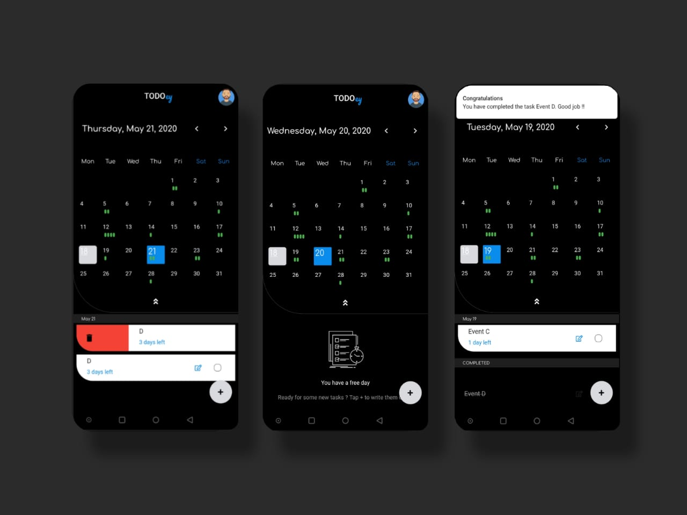
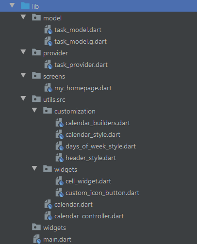

[](https://github.com/Shadow60539/D-Sanjeev-Madhav_IRIS_2020)

# Introduction

> “TODOey”
is a small, simple and beautiful app，
It can help you keep track of your daily plans.
If you happen to have the habit of writing a mission plan, then it must be perfect for you.

Before we start, you can take a look at the app:




### Packages


Some very good packages are used in the project, not a big list.


Below are the information about these packages.


package | explain
---|---
[hive](https://pub.flutter-io.cn/packages/hive) | local storage
[provider](https://pub.flutter-io.cn/packages/provider) | state management
[test](https://pub.flutter-io.cn/packages/test) | unit test
[path_provider](https://pub.flutter-io.cn/packages/path_provider) | get path
[hive_flutter](https://pub.flutter-io.cn/packages/image_crop) | hive flutter package
[font_awesome_flutter](https://pub.flutter-io.cn/packages/font_awesome_flutter) | awesome icons
[table_calendar](https://pub.flutter-io.cn/packages/table_calendar) | calendar ui
[date_format](https://pub.flutter-io.cn/packages/date_format) | wordy dates
[audioplayers](https://pub.flutter-io.cn/packages/audioplayers) | play ui click sounds
[flutter_local_notifications](https://pub.flutter-io.cn/packages/flutter_local_notifications) | local notifications
[hive_generator](https://pub.flutter-io.cn/packages/hive_generator) | hive generator flutter
[build_runner](https://pub.flutter-io.cn/packages/build_runner) | to build custom models for hive


### Directory Structure

The project directory structure is as follows:

```
├── android
├── assets
├── fonts
├── build
├── images
├── ios
├── lib
├── test
├── pubspec.lock
├── pubspec.yaml

```


Let me explain the other directories besides **lib**:

directory | explain
---|---
images | For storing various pictures
fonts | custom fonts
assets | sound (.wav) files

Then the lib directory





directory | explain
---|---
model | Model layer directory for task_model
provider | Provider State Management (I could have used _bloc but I'm familiar with providers)
utils | Custom calendar created by me


